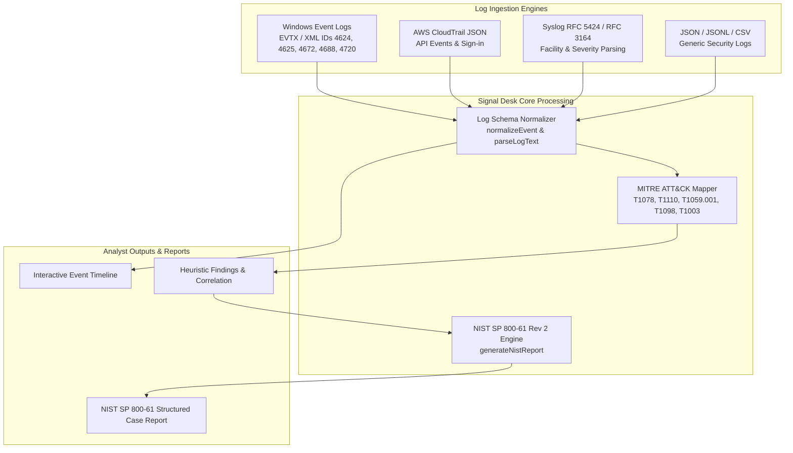

# Signal Desk

[](https://github.com/drummer475-94/signal-desk/actions)
[](https://github.com/drummer475-94/signal-desk)
[](https://csrc.nist.gov/pubs/sp/800/61/r3/final)
[](https://attack.mitre.org/)
[](LICENSE)

Signal Desk is a browser-based incident-operations and multi-format log-triage workbench. It ingests Windows Security Events (EVTX/XML Event IDs 4624, 4625, 4672, 4688, 4720), AWS CloudTrail JSON exports, and Syslog (RFC 5424 / RFC 3164), correlates events, maps findings to MITRE ATT&CK techniques, and generates structured legacy NIST SP 800-61 Rev. 2-style reports. NIST SP 800-61 Rev. 3 is the current guidance.

**[Open Live App](https://drummer475-94.github.io/signal-desk/)**

---

## ⚡ 60-Second Quick Review Guide

1. **Scan Live Demo Findings**: Click **Load Demo Case** to view pre-loaded multi-source security events across VPN gateways, EDR alerts, Windows AD events, and AWS CloudTrail.
2. **Inspect MITRE ATT&CK Correlation**: Review automatically detected findings annotated with explicit MITRE ATT&CK technique IDs (`T1078 Valid Accounts`, `T1110 Brute Force`, `T1059.001 PowerShell`, `T1098 Account Manipulation`, and `T1003 OS Credential Dumping`).
3. **Generate NIST SP 800-61 Rev 2 Incident Report**: Export a case JSON package containing the structured 4-phase incident handling report (Preparation, Detection & Analysis, Containment/Eradication, Post-Incident Activity), analyst decisions, findings, and sanitized evidence.
4. **Local Privacy & Zero Dependencies**: Built with pure browser-native JavaScript (ES modules) with 0 external runtime dependencies.

---

## Architecture & Data Flow



---

## Technical Features

- **Multi-Format Security Log Parsers**: Native parsing for Windows Event XML/EVTX (Event IDs 4624 Logon, 4625 Failed Logon, 4672 Special Privileges, 4688 Process Creation, 4720 Account Creation), AWS CloudTrail JSON logs, and Syslog RFC 5424 / RFC 3164.
- **MITRE ATT&CK Framework Mapping**: Automatic correlation and tagging for:
  - **T1078 (Valid Accounts)**: Disabled account authentication & legacy sign-in attempts.
  - **T1110 (Brute Force)**: Authentication failure bursts (5+ failures in 10 minutes) and failure-then-success patterns.
  - **T1059.001 (Command and Scripting Interpreter: PowerShell)**: Encoded PowerShell command execution (`-enc`, `FromBase64String`, `IEX`).
  - **T1098 (Account Manipulation)**: Account creation (4720) and privileged role modification (4672).
  - **T1003 (OS Credential Dumping)**: Credential access signatures, Mimikatz patterns, and LSASS memory access.
- **NIST SP 800-61 Rev 2 Report Generator**: Structured 4-phase incident handling export:
  1. **Preparation**: Baseline inventory & logging health.
  2. **Detection & Analysis**: Severity counts, MITRE ATT&CK coverage, impacted actors & IPs.
  3. **Containment, Eradication & Recovery**: Specific containment steps per detected technique, eradication procedures, system recovery checks.
  4. **Post-Incident Activity**: Lessons learned, policy updates, IOC indicators.
- **Test Coverage**: >90% code coverage enforced via Node.js native test runner.

---

## Verification & Testing

Run unit tests and verify code coverage:

```bash
# Run unit tests across all test suites
node --test tests/*.test.js

# Run test coverage verification (>90% threshold)
node --test --experimental-test-coverage tests/*.test.js
```

---

## Professional Standards Alignment

- **NIST SP 800-61 Rev. 2**: Legacy workflow retained for compatibility with this exercise; Rev. 3 is current guidance.
- **MITRE ATT&CK**: Enterprise technique mappings used by the detection rules.
- **CISA Security Logging Guidance**: Best practices for centralizing and auditing critical system logs.
